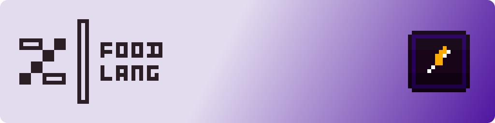

# Food-Lang

## About

**Food Lang** is my personal version of the popular food-related utility pack. While there are plenty of these utility packs, either as standalone or larger projects like [Vanilla tweaks](https://vanillatweaks.net) or [Icons](https://modrinth.com/resourcepack/icons), Food Lang originally outdates them and brings it's own twist to the table. It provides food and saturation levels and also hints to possible effects. All languages are supported.

## Additional Version's

**~~Numerical Exacts~~ (Out of Date)** - this version of the pack shows the exact numbers for the values. this version would be for those who prefer to see the number rather than just a rough bar graph. This is especially important for saturation since its values are not whole numbers.

## Credits & Acknowledgements 

- [mr_ch0c0late](https://modrinth.com/user/mr_ch0c0late) & [Zartrix](https://modrinth.com/user/Zartrix) - Unicode Magic \[_Inspiration/Assistance_\]

---

## Contributing

If you'd like to contribute to the development of Food Lang, here are some guidelines:

1. If you are familiar with GitHub, create a new issue, add your suggested additions, changes, improvements, and/or updates, and submit. 
2. If you are unfamiliar with GitHub, you can upload your suggested contribution on the discord server and it'll be uploaded as an issue on your behalf.

I'll then review and filter suggestions, and if they match with the vision of the project, they'll be added into the project.

> [!Info]
> For those who know what they are doing, feel free to work in a new branch, and make a merge request to the `dev` branch. 
> 
> This would be a great help, especially when it comes to updates and bug fixes!

---

## License and Use

This work is licensed under <a href="https://creativecommons.org/licenses/by-nc-sa/4.0/?ref=chooser-v1" target="_blank" rel="license noopener noreferrer" style="display:inline-block;">CC BY-NC-SA 4.0</a>

A **lot** of work goes into Resource Packs. 
Please respect the wishes of the authors, and consult with them before taking any action concerning their work.

Thank you kindly.